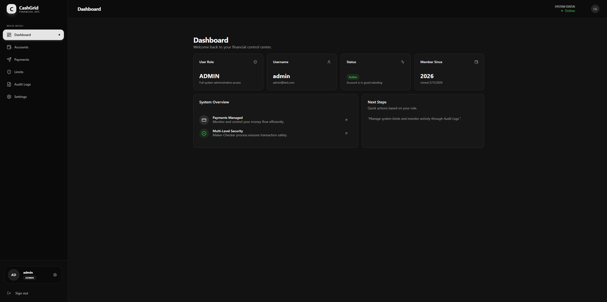
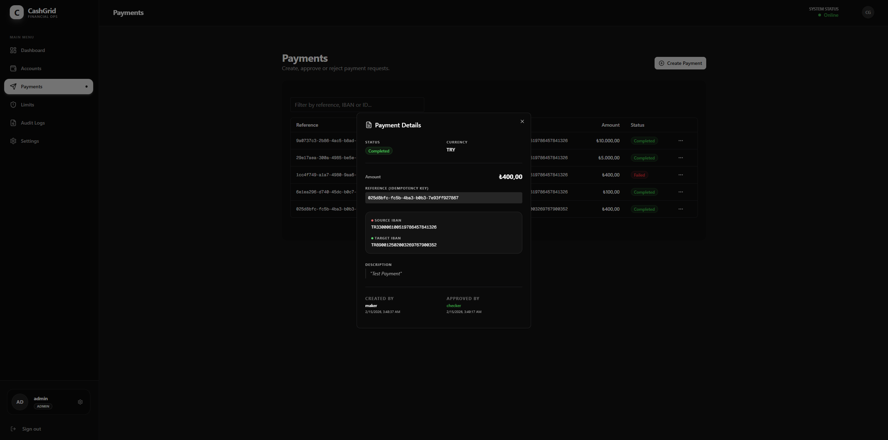
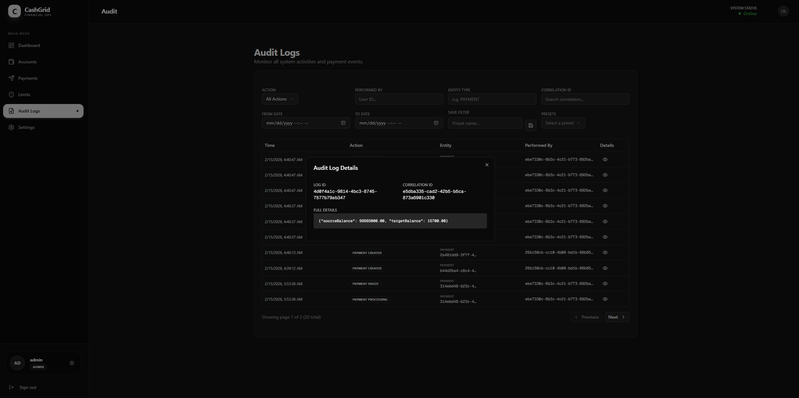
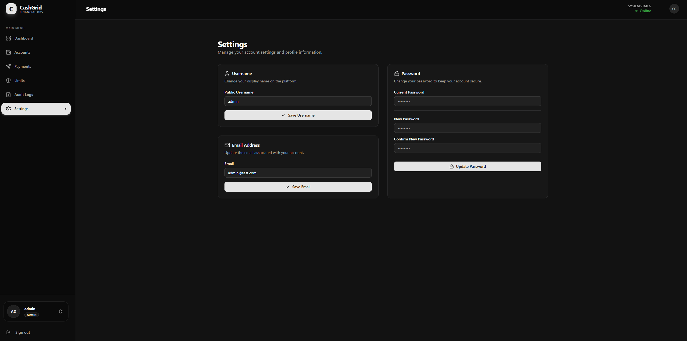

# CashGrid — Full-Stack Commercial Cash Payment Platform

A production-grade, full-stack financial operations platform. Featuring a modern **Next.js** frontend and a robust **Spring Boot** backend, built to manage commercial money flows with high security and auditability.

---

## 📸 Visual Tour

### 📊 Dashboard Overview


_Centralized view of system status, user roles, and quick actions._

### 💸 Payments & Details


_Modern payment table with the new **Transaction Details Pane** showing full audit history._

### 📝 Audit Logs


_Detailed, tamper-proof logs capture every significant action in the system. Each audit entry records the user, timestamp, action type, and affected entities, ensuring full traceability for compliance and security reviews._

### 👤 Profile & Security


_Comprehensive account management for updating credentials and preferences._

---

## 🛠 Tech Stack

### 💻 Frontend

- **Framework**: Next.js 15 (App Router)
- **Styling**: Tailwind CSS 4 (Modern utility-first CSS)
- **UI Components**: Shadcn UI (Radix UI Primitives)
- **State Management**: Zustand
- **Data Fetching**: TanStack Query v5 (React Query)
- **Forms**: React Hook Form + Zod Validation
- **Icons**: Lucide React

### ⚙️ Backend

- **Language**: Java 21
- **Framework**: Spring Boot 4.0.2
- **Security**: Spring Security + JWT (jjwt)
- **Database**: PostgreSQL 18 + Flyway Migrations
- **API Docs**: Swagger UI (springdoc-openapi)
- **Rate Limiting**: Bucket4j

---

## 🚀 Quick Start (Docker)

The easiest way to run the entire stack (Frontend, Backend, and Database) is using Docker Compose.

```bash
docker compose up --build
```

- **Frontend**: [http://localhost:3000](http://localhost:3000)
- **Backend API**: [http://localhost:8080](http://localhost:8080)
- **Swagger UI**: [http://localhost:8080/swagger-ui.html](http://localhost:8080/swagger-ui.html)

---

## 🏗 Architecture & Features

### Key Modules

- **Auth Module**: Secure JWT-based authentication with Login, Register, and Token Refresh.
- **Account Module**: Management of bank accounts with TR Mod-97 IBAN validation.
- **Payment Module**: Maker-Checker workflow ensuring no single point of failure for transactions.
- **Limit Module**: Dynamic transaction limits configured per role and currency.
- **Audit Module**: Immutable event sourcing for every payment state change.

### Highlights

- **Maker-Checker Process**: Payments created by a `MAKER` must be approved by a `CHECKER`.
- **Idempotency**: Prevents duplicate payments using unique reference keys.
- **Real-time Validation**: Frontend and Backend Zod/Jakarta validation for data integrity.
- **Profile Management**: Users can securely update their username, email, and password.
- **Modern UI**: Sleek, responsive interface with Dark/Light mode support.

---

## 📡 API Overview

### Authentication & Profile

| Method | Endpoint                   | Description               | Access        |
| :----- | :------------------------- | :------------------------ | :------------ |
| POST   | `/api/v1/auth/login`       | Authenticate & get tokens | Public        |
| PATCH  | `/api/v1/auth/me/username` | Update display name       | Authenticated |
| PATCH  | `/api/v1/auth/me/email`    | Update contact email      | Authenticated |
| PUT    | `/api/v1/auth/me/password` | Change security password  | Authenticated |

### Core Operations

| Module       | Feature    | Capability                                                     |
| :----------- | :--------- | :------------------------------------------------------------- |
| **Accounts** | CRUD       | Create, Read, Update, and Soft-Delete bank accounts.           |
| **Payments** | Workflow   | Initiate, Approve, Reject, and View detailed transaction logs. |
| **Limits**   | Controls   | Set maximum single and daily limits for roles.                 |
| **Audit**    | Compliance | Filter and search through immutable system logs.               |

---

## 🧪 Testing

### Backend Integration Tests

Uses **Testcontainers** to run 40+ tests against a real PostgreSQL instance.

```bash
./gradlew :backend:test
```

### Frontend Linting

```bash
cd frontend
npm run lint
```

---

## 📁 Project Structure

```
cash-grid/
├── frontend/                # Next.js Application
│   ├── src/app/             # Pages and Layouts
│   ├── src/components/ui/   # Shadcn Components
│   └── src/lib/             # API, Hooks, and Store
├── backend/                 # Spring Boot Application
│   ├── src/main/java/       # Business Logic
│   └── src/test/java/       # Integration Tests
├── docker-compose.yml       # Full-stack Orchestration
└── README.md                # Project Documentation
```

---

## 📄 License

This project is built for educational and demonstration purposes.
